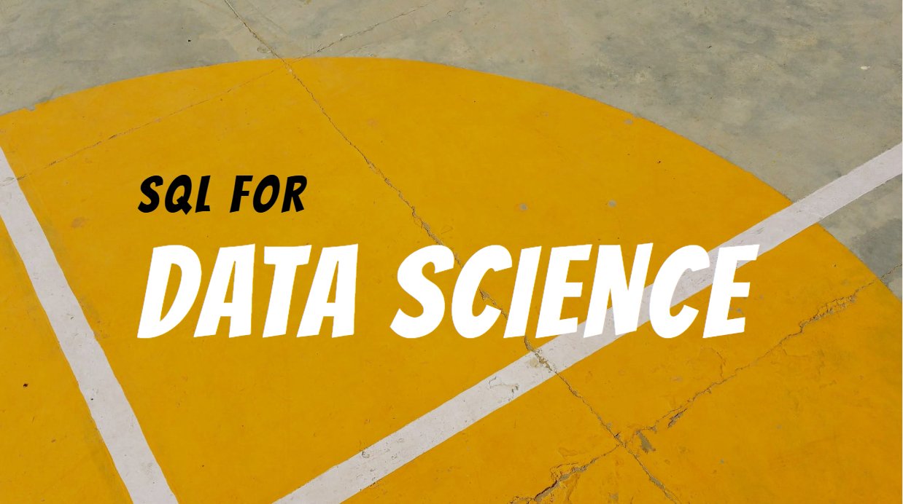

# SQL FOR DATA SCIENCE

These sessions are about understanding how SQL plays a vital role in the field of data science & how SQL can be used to store, access and retrieve data to perform data analysis.

Here’s a list of topics covered in Part 1:

1. Introduction To Data Science
2. SQL for Data Science
3. What Is SQL? 
4. Basics Of SQL - Create/Insert/Update/Delete/Drop
5. Sorting
6. Joins in SQL
7. MySQL Hands-on practice

Here’s a list of topics covered in Part 2:

1. Basics of SQL - Recap
2. Aggregation Functions
3. Ordering & Having Clause
4. String & Date-Time Functions
5. Regular Expressions (RegEx)
6. Nested Queries
7. MySQL Hands-on practice

Once you are done with Part 1 & 2, you can also check the SQL-Python Connectivity video to understand how SQL & Python interacts.

## Part 1: 
https://www.youtube.com/watch?v=ch_vJ15TeI0

## Part 2: 
https://www.youtube.com/watch?v=F_CfUuvpqWI

## SQL-Python Connectivity
https://www.youtube.com/watch?v=vY8rS0x1VDE

